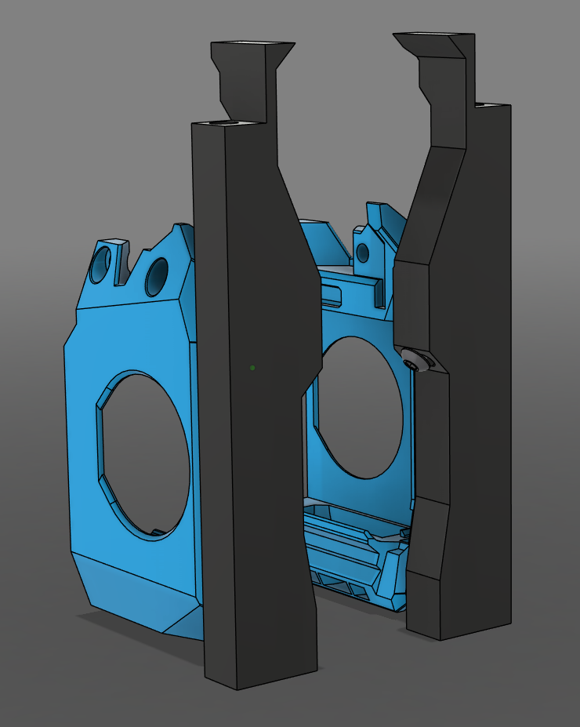
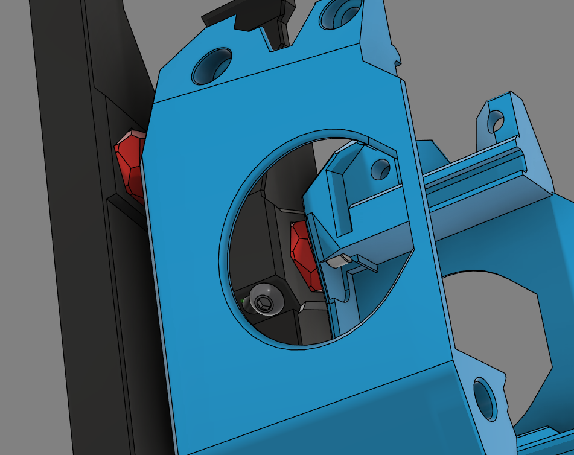

# Anthead Magnetic Duct Docks

 

 

## Description

Additional magnets are inserted into the front of the SF Anthead ducts to allow extra support of the tool as it gets docked. The Front pieces of the Modular Dock have been adapted to suit the shape of the Anthead and include adjustable magnet "Pucks" to coincide with the Anthead Duct. With these changes I have had incredibly consistent docking which in turn has made it possible to speed up the tool changes.

## Hardware BOM (Per Tool)

- 6x3mm N52 Magnets x4
- M3 Heat Inserts x2
- M3x16 BHCS screws x2

## Printed BOM (Per Tool)

- Anthead SF Left Duct
- Anthead SF Right Duct
- Pucks (Choose version to suit your build)
- Dock Front Left (Choose version to suit your build)
- Dock Front Right (Choose version to suit your build)

## Instructions

- Prepare the front pieces of the dock as per the Modular Dock manual.
- Install an M3 meat insert into each of the pucks.
- Glue a 6x3mm magnet into each of the pucks making sure they have the same polarity.
- Slide a 6x3mm magnet into the top of each duct ensuring they attract to the magnets in the pucks. Glue them in place.
- Finish Preparing the ducts as per the Anthead manual. Note; the fans cannot be screwed in with this mod.
- Install the ducts on the Anthead.
- Insert a puck into each of the sides so that the heat insert is opposite the slot. You want the puck to be out as far as possible while being able to loosely screw in the M3x16 BHCS screw.
- Install the dock pieces as per the Modular Dock manual.

## Post Install

- While setting your dock position; ensure the dock backplate lower than required and the pucks are loose and out as far as they can go with the screw still in place.
- Line the tool up with the dock into its resting position. The pucks should be touching the Anthead ducts and have moved into position.
- Tighten the M3x16 BHCS screws.
- Move the dock backplate up until it touches the feet of the Anthead Stealthchanger Backplate and tighten its screws.

---
## Credits
[Hartk](https://github.com/hartk1213) - Original Anthead Ducts